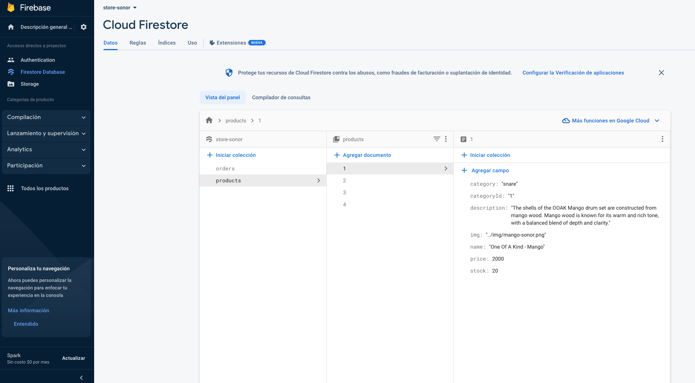
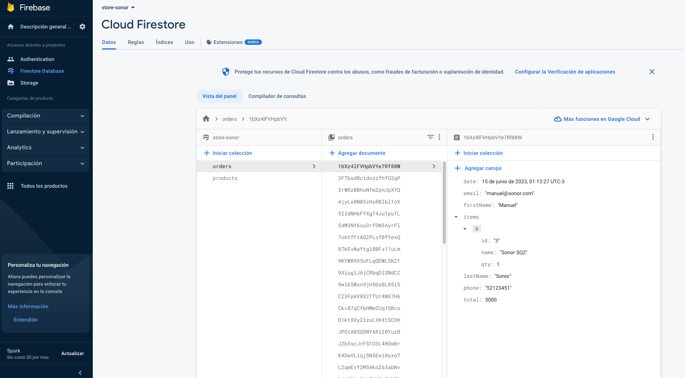

# **Proyecto Final - Ecommerce de Instrumentos**

Este es el proyecto final para el curso de React en Coderhouse. Se trata de un ecommerce ficticio de instrumentos SONOR, donde los usuarios pueden explorar y comprar una variedad de instrumentos.

>
>[**IR a: responsinator.com**](http://www.responsinator.com/?url=https%3A%2F%2Fgregarious-haupia-7b456e.netlify.app%2F)
>
>[**IR a: sitio en netlify**](https://gregarious-haupia-7b456e.netlify.app/)
>

## **Tecnologías utilizadas**
---
| Tecnología  | Descripción                                                                 |links|
|-------------|-----------------------------------------------------------------------------|-----|
| React       | Biblioteca de JavaScript para construir interfaces de usuario.               |[ir](https://es.react.dev/)|
| Toastify    | Biblioteca de notificaciones para React.                                     |[ir](https://www.npmjs.com/package/toastify-js)|
| Firebase    | Plataforma de desarrollo de aplicaciones web y móviles, utilizada como base de datos y hosting. |[ir](https://firebase.google.com/?hl=es)|
| Bootstrap   | Framework de CSS para estilizar y diseñar el sitio web.                      |[ir](https://getbootstrap.com/docs/5.3/getting-started/introduction/)|
| Vite        | Herramienta de compilación y desarrollo rápida para aplicaciones web.        |[ir](https://vitejs.dev/guide/)|
| Git         | Sistema de control de versiones distribuido.                                 |[ir](https://git-scm.com/)|
| GitHub         | GitHub es una plataforma web basada en Git que facilita el alojamiento y la colaboración en proyectos de desarrollo de software                                 |[ir](https://github.com/)|
| Netlify         | Netlify es una plataforma de alojamiento y despliegue web que simplifica el proceso de implementación y hospedaje de aplicaciones web estáticas y dinámicas.                                  |[ir](https://app.netlify.com/)|
---

## **Características del proyecto**

- Muestra una lista de instrumentos disponibles para la venta.
- Permite agregar instrumentos al carrito de compras.
- Permite ver el detalle de cada instrumento, incluyendo su descripción y precio.
- Provee una función de búsqueda por categoria.
- Muestra notificaciones utilizando la biblioteca Toastify.
- Utiliza Firebase para almacenar y recuperar información sobre los instrumentos y las transacciones de compra.
- Está diseñado utilizando Bootstrap para una apariencia profesional y responsive.

## **Instalación**

1. Clona este repositorio en tu máquina local.
2. Navega hasta la carpeta del proyecto en la terminal.
3. cd app/store
3. Ejecuta el comando `npm install` para instalar las dependencias.
4. Ejecuta el comando `npm run dev` para iniciar la aplicación en modo de desarrollo.
5. Abre tu navegador web y visita `http://localhost:3000` para ver el sitio en funcionamiento.

## **Contribución**

Si deseas contribuir a este proyecto, puedes realizar los siguientes pasos:

1. Haz un fork de este repositorio.
2. Crea una rama con un nombre descriptivo para tu contribución.
3. Realiza los cambios en tu rama.
4. Realiza un pull request hacia la rama principal de este repositorio.

## **Licencia**

Este proyecto está bajo la Licencia MIT. Puedes consultar el archivo LICENSE para más detalles.

---
## **Firebase**
> Esturctura de los datos: 

`Para el alta de productos es necesario tener establecida la colleccion products y los documentos nombrados por su ID respetando las keys de la imagen.`

`Para las ordenes solo hay que tener definida la colleccion orders y la app se encarga de agregar los documentos una vez procesadas las compras.`

---

## **Roadmap**
* Uso de LocalStorage
* Manejo de Modo Oscuro y Claro
* Recordar el carrito
* Enriquecer mas las pantallas con (Carrousel, video)..

---